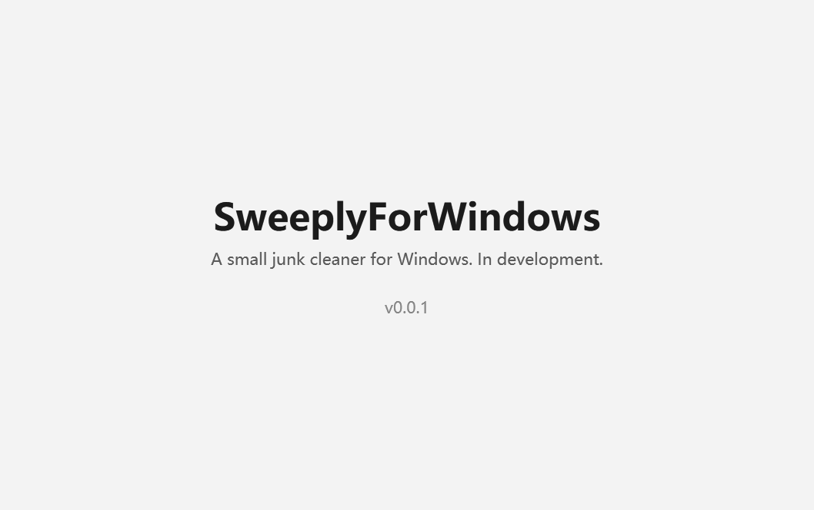
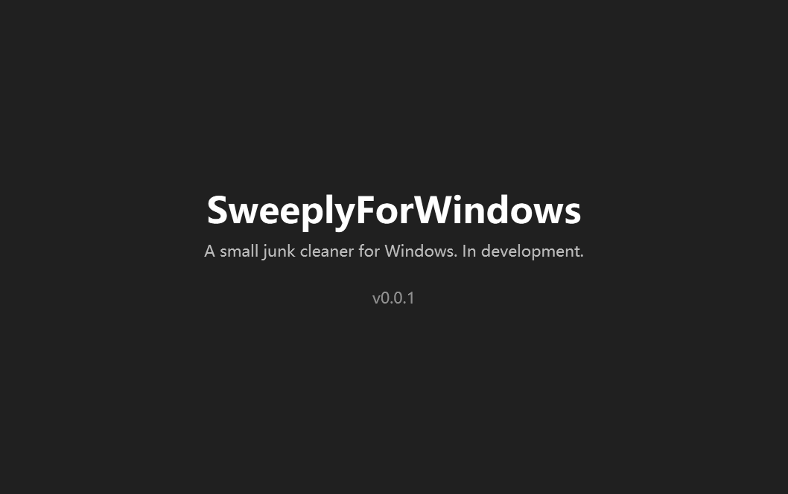

# SweeplyForWindows

A small junk cleaner for Windows. Open source, offline.

一个小巧的 Windows 垃圾清理工具。开源、离线。

> **Status: in development (0.0.1).** This build only shows a window; cleaning comes next.

<p align="center">
  
  
</p>

## Build

Requires the .NET 9 SDK.

```powershell
dotnet build
dotnet test
powershell -ExecutionPolicy Bypass -File tools\release.ps1   # self-contained zip in artifacts\
```

`SweeplyForWindows.exe --snapshot <folder>` renders the window to PNG (light and dark)
without capturing the screen — that is how the screenshots above are made.

## Support

If it helps you, you can buy the developer a coffee: see [docs/donate](docs/donate/).

## License

[MIT](LICENSE)
