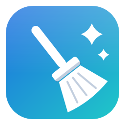
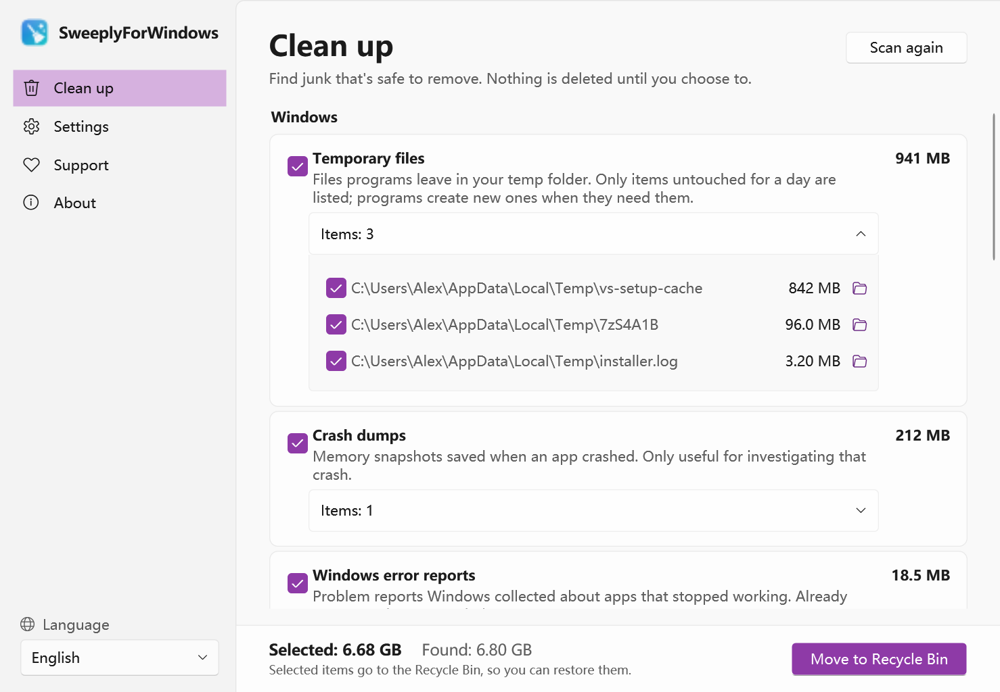
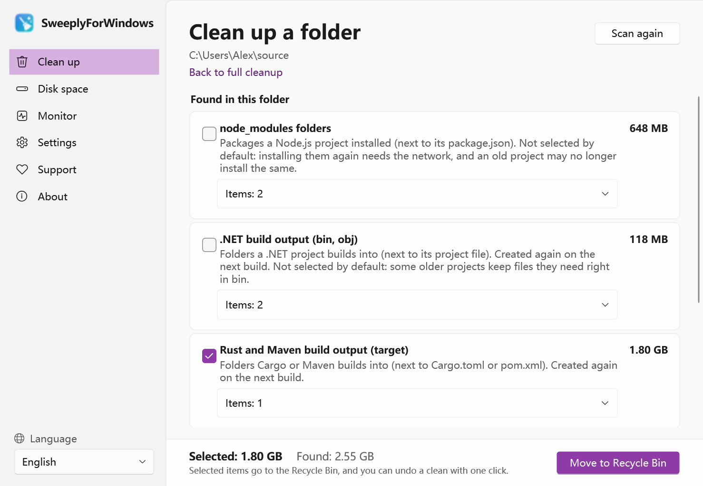
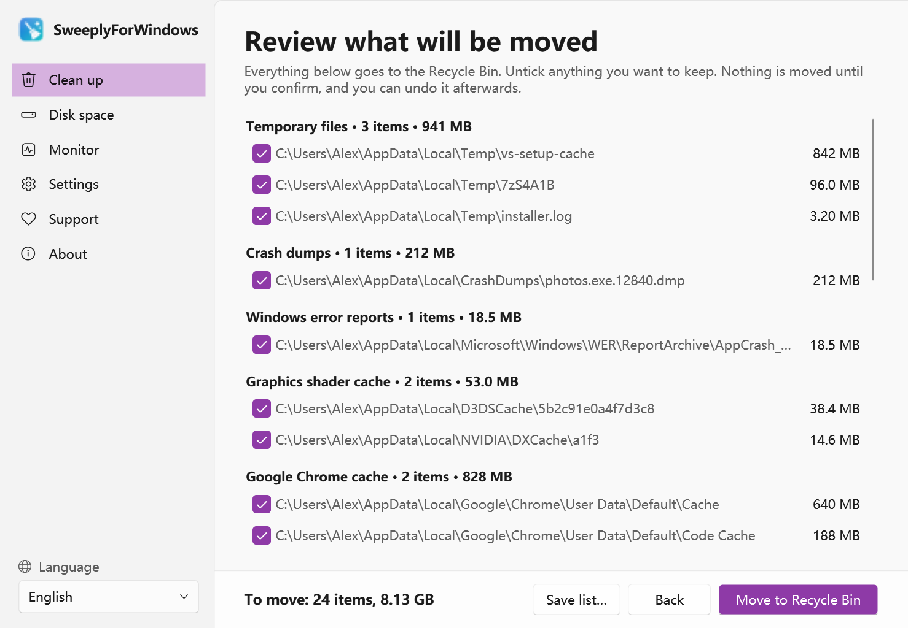
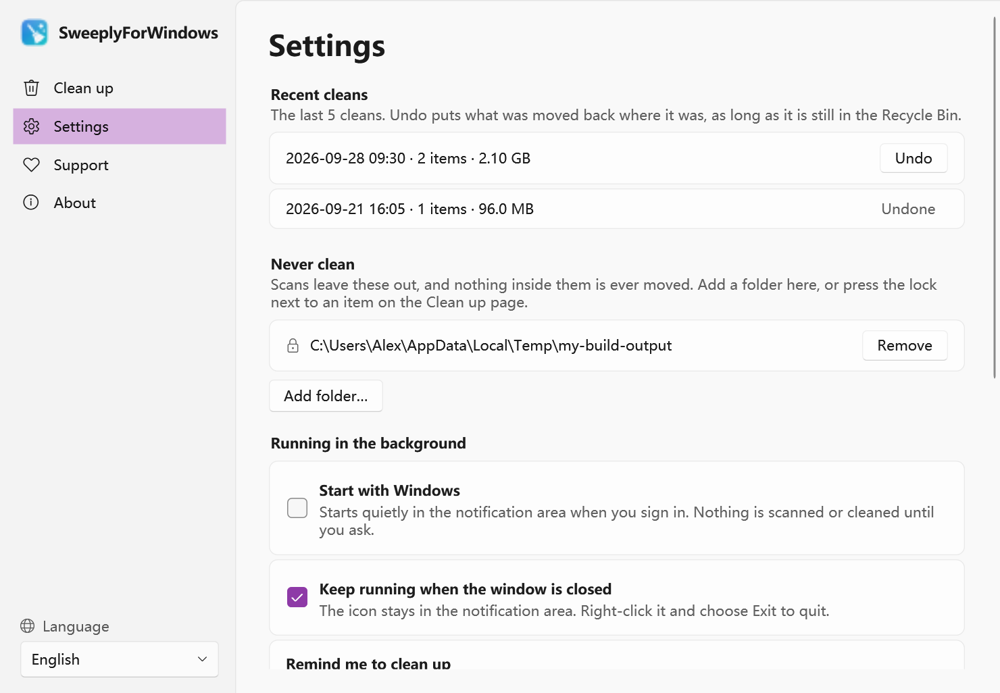
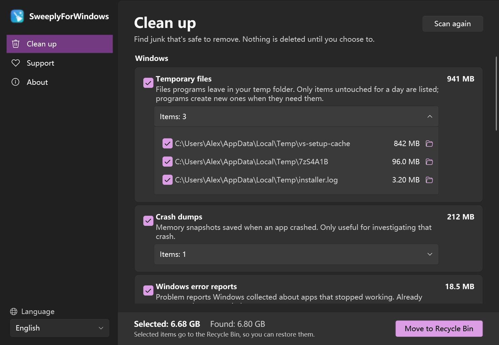

<p align="center"></p>

<h1 align="center">SweeplyForWindows</h1>

<p align="center">
  A small, honest junk cleaner for Windows.<br>
  Open source · Offline · No ads · No accounts
</p>

<p align="center">
  <a href="../../releases"></a>
  <a href="../../releases"></a>
  
  <a href="LICENSE"></a>
</p>

<p align="center"><b>English</b> · <a href="README.zh-CN.md">简体中文</a></p>

SweeplyForWindows finds caches, temporary files and developer leftovers you can safely remove,
shows you exactly what they are, and never deletes anything until you choose to.

<p align="center">
  
</p>

> **Status: preview (0.3).** Cleaning, undo, the "Never clean" list, the folder right-click menu,
> clean-up reminders, background mode and the activity monitor all work.

## What it finds

**Windows**
- Temporary files programs left behind (only items untouched for a day)
- Crash dumps and Windows error reports
- Graphics shader caches of Windows and the NVIDIA, AMD and Intel drivers

**Browsers**
- Disk caches of Microsoft Edge, Google Chrome, Firefox, Brave, Vivaldi, Opera, Yandex Browser,
  360 Browser and QQ Browser — history, passwords and sign-ins are kept

**Chat apps**
- WeChat (current and older versions) and WeCom: cache and logs; chat pictures, videos and
  received files over 6 months old, which are not selected by default. Chat history, documents
  and synced files are never touched.
- QQ, DingTalk and Feishu / Lark: the caches of their built-in browsers

**Developer tools**
- npm, pip, NuGet, Yarn, Gradle, Go and Cargo caches
- VS Code, VSCodium and Cursor: caches, old logs, crash reports and extension downloads —
  settings, extensions and workspaces are kept

**Other apps**
- Steam, Discord, Slack, Spotify, Microsoft Teams and NetEase Cloud Music: the caches of their
  built-in browsers. A folder only counts when what is inside really is a cache, not because of its name.

**Downloads**
- Installers (.exe, .msi, .msix) in your Downloads folder — not selected by default

Apps that are not on your PC are not shown. Each category explains what it is and whether it comes back. Expand it to see every item,
show it in File Explorer, or untick the ones you want to keep.

## Clean up a project folder

<p align="center">
  
</p>

Turn on **Settings → File Explorer → Add to the folder right-click menu**, then right-click a folder
(or empty space inside one) and choose **Clean up with SweeplyForWindows**. It looks through that
folder for:

- `node_modules` next to a `package.json`
- `bin` and `obj` next to a .NET project file
- `target` next to `Cargo.toml` or `pom.xml`; `build` and `.gradle` next to `build.gradle`
- Python caches: `__pycache__`, `.pytest_cache`, `.mypy_cache`, `.ruff_cache`
- Office owner files (`~$…`), and `.tmp`, `Thumbs.db` and `.DS_Store`, untouched for a day

A build folder only counts next to the project file that creates it, so your own folder called
`build` or `bin` is never offered. `node_modules` and .NET `bin`/`obj` are not ticked by default.
Folders starting with a dot (`.git`, `.vscode`…) are never looked into, and Windows, Program Files
and app data can't be scanned at all. The same list, Recycle Bin and undo apply.
On Windows 11 the entry is under **Show more options**.

## Safety first

<p align="center">
  
</p>

- **Nothing is moved without you.** Sweeply only scans. Before anything moves, you see the full list
  of what would go, can untick any item or save the list, and then confirm. The one exception is
  Clean up every day, if you turn it on (see below).
- **Everything goes to the Recycle Bin**, so you can restore it. If something is too big for the
  Recycle Bin, Windows asks you first instead of deleting it for good.
- **Undo.** The last 5 cleans can be undone: what was moved goes back where it was, as long as it
  is still in the Recycle Bin.
- **A "Never clean" list.** Add folders in Settings, or press the lock next to an item. Anything on
  the list, or inside it, is never offered or moved.
- **Checked twice.** Right before moving, each item is checked again: still inside its category's
  folder, not a link to somewhere else, on this PC's own disk, not on the "Never clean" list, and
  its app not running. Items that must be old enough (temporary files, old chat pictures) still have to be.
- **Only this PC's own disks.** USB sticks and network drives are never touched.
- **Apps are left alone while they're open** (browsers, WeChat), and files in use are skipped.
- **Works offline.** No network requests, no analytics, no accounts.

## Runs quietly in the background

<p align="center">
  
</p>

- **Stays in the notification area.** Closing the window keeps it there; right-click the icon to exit.
  You can turn this off in Settings.
- **Start with Windows** (off by default): starts as an icon only when you sign in.
  Nothing is scanned or cleaned until you ask (or turn on Clean up every day).
- **Clean-up reminder** (off by default): every week or month it looks — only reads — and shows a
  notification when at least 1 GB can be cleaned. Cleaning by hand starts the wait again.
- **Clean up every day** (off by default): once a day it moves what is ticked by default to the
  Recycle Bin, except package caches and graphics shader caches, which would only be downloaded or
  built again. Open apps and the "Never clean" list are skipped as always, and anything the Recycle
  Bin can't take is left alone. No list is shown first: a notification says what was moved, and it
  can be undone like any other clean.
- **Activity monitor**, every part optional:
  - a live number on the icon: CPU usage, download or upload speed, or disk writes;
  - download and upload speed, CPU usage and disk writes when you point at the icon;
  - a small floating bar that stays on top of other windows. Drag it anywhere; right-click it to hide it.

<p align="center">
  
</p>

The readings come from Windows itself (performance counters and network adapters) and never leave your PC.

## Made for Windows

<p align="center">
  
</p>

- Windows 11 Fluent look that follows your light / dark theme and accent colour.
- Progress in the window and on the taskbar button while scanning and cleaning.
- Finds your Downloads folder even if you moved it to another drive.
- 7 languages, switch any time from the sidebar — no restart needed:
  English, 简体中文, 繁體中文, 日本語, Русский, Español, हिन्दी.
  Translations other than English and Chinese would love a review from native speakers.

## Install

1. Download `SweeplyForWindows-<version>-win-x64.zip` from [Releases](../../releases).
2. Unzip it anywhere and run `SweeplyForWindows.exe`. Nothing to install, no .NET needed.
3. Windows SmartScreen may say the app is unrecognised, because it isn't code-signed yet.
   Click **More info → Run anyway**.

Requires 64-bit Windows 10 or 11.

## Build from source

Requires the .NET 9 SDK.

```powershell
dotnet build
dotnet test
powershell -ExecutionPolicy Bypass -File tools\release.ps1   # zip in artifacts\
```

- `SweeplyForWindows.exe --snapshot <folder>` renders every page with made-up results, in every
  language, light and dark — without capturing the screen. That's how the screenshots here are made.
- `SweeplyForWindows.exe --scan-report <file>` scans read-only and writes each category's status,
  item count and size, without any paths — handy to attach to a bug report.

## Support SweeplyForWindows

SweeplyForWindows is free and always will be. If it saved you some space or some time,
you can buy the developer a coffee — WeChat Pay or Alipay in China, PayPal anywhere.
Every coffee keeps the project going. Thank you!

<table align="center">
  <tr>
    <th>WeChat Pay</th>
    <th>Alipay</th>
    <th>PayPal</th>
  </tr>
  <tr>
    <td></td>
    <td></td>
    <td></td>
  </tr>
</table>

Not in a position to donate? A ⭐ on this repo, a bug report or a translation fix helps just as much.

## Contact

Bugs and ideas: [open an issue](../../issues).

## License

[MIT](LICENSE)
