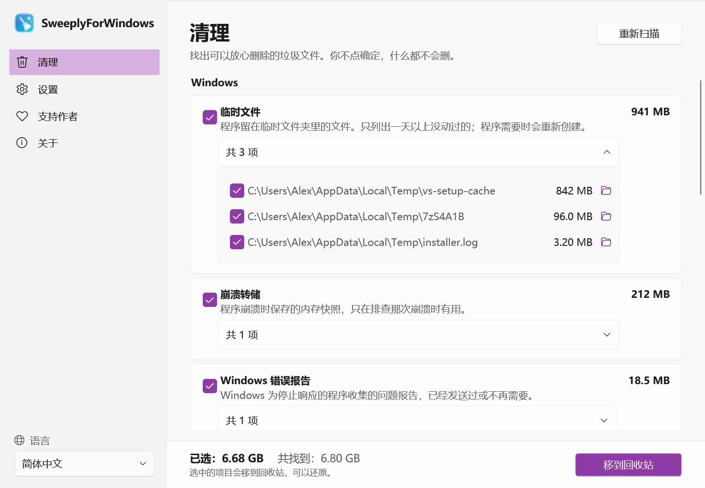
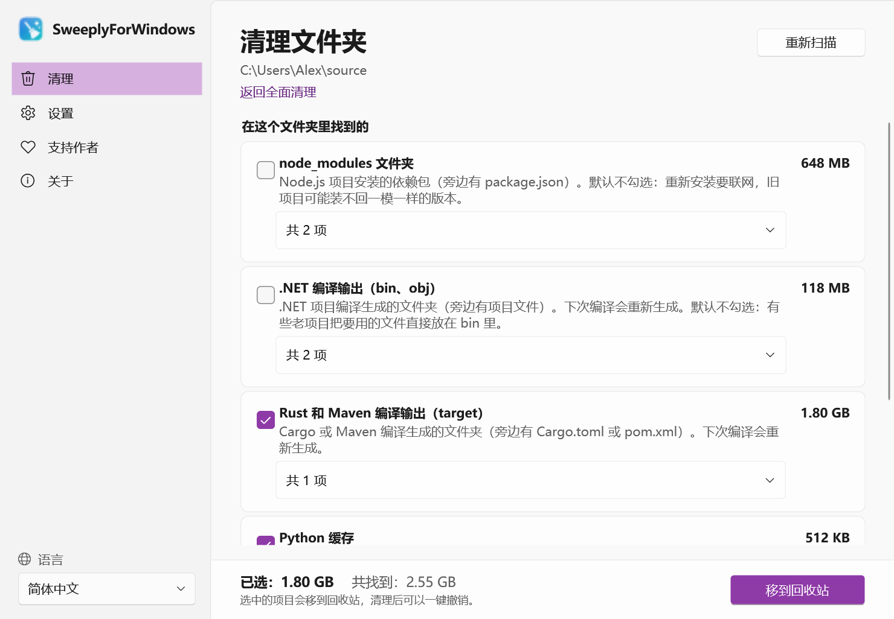
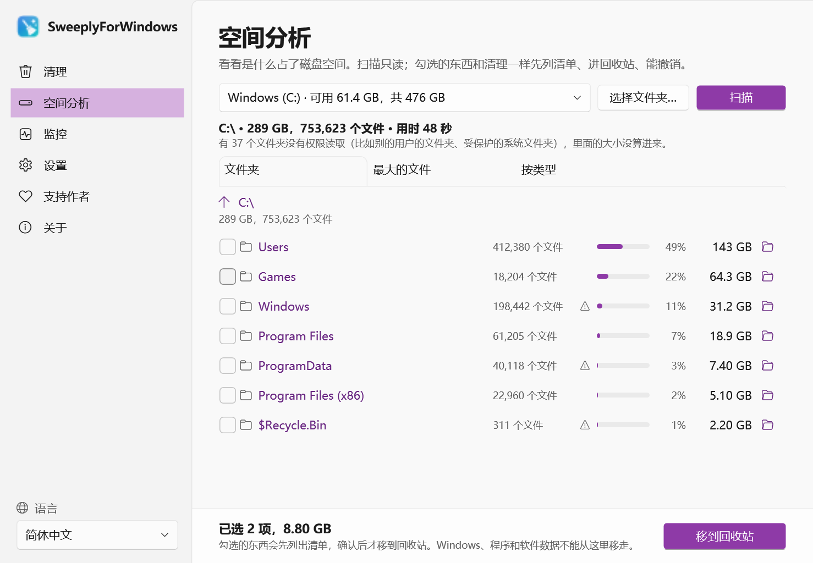
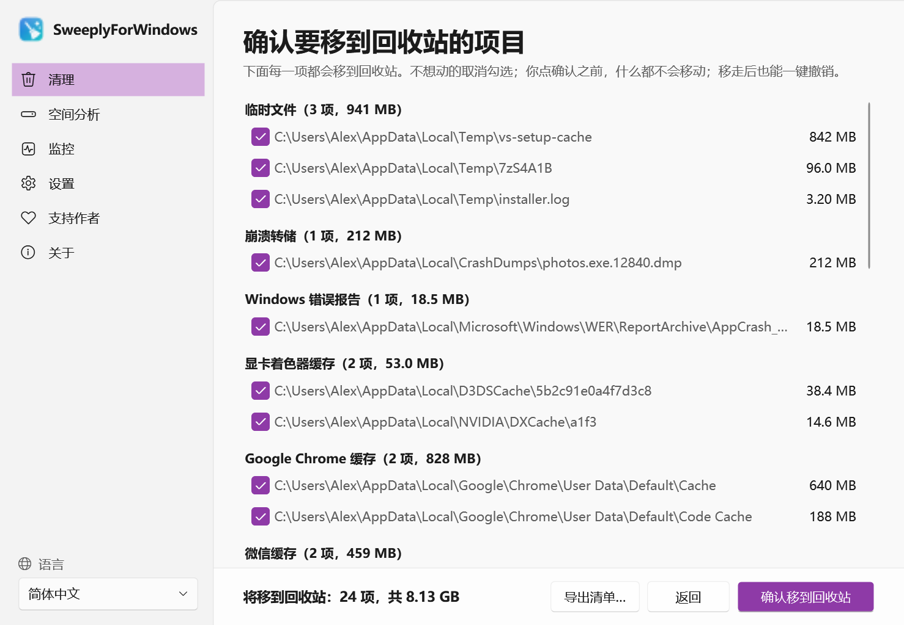
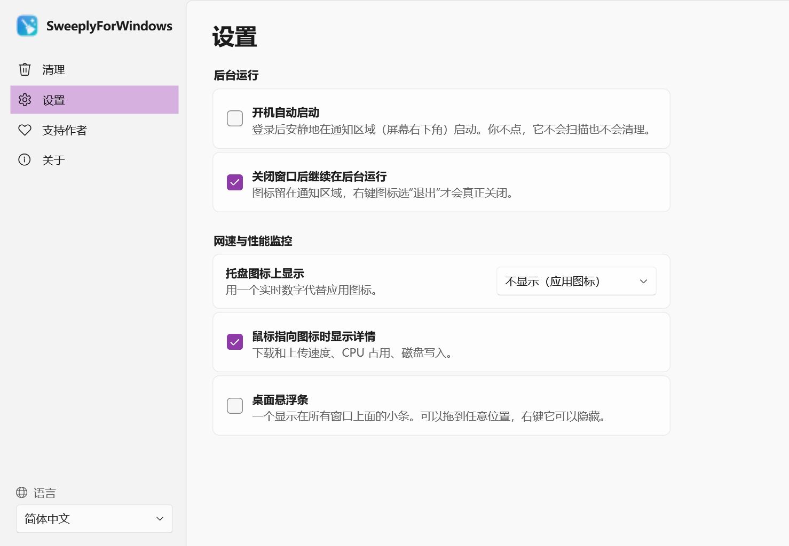
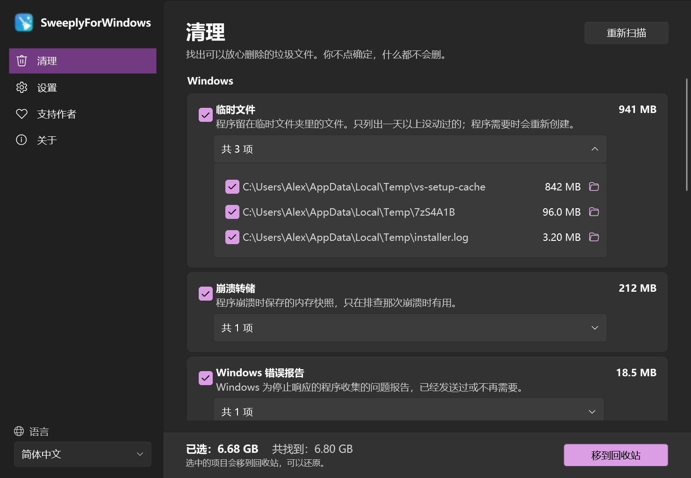

<p align="center"></p>

<h1 align="center">SweeplyForWindows</h1>

<p align="center">
  一个小巧、老实的 Windows 垃圾清理工具。<br>
  开源 · 离线 · 无广告 · 无需账号
</p>

<p align="center">
  <a href="../../releases"></a>
  <a href="../../releases"></a>
  
  <a href="LICENSE"></a>
</p>

<p align="center"><a href="README.md">English</a> · <b>简体中文</b></p>

SweeplyForWindows 找出可以放心删除的缓存、临时文件和开发工具留下的垃圾，把每一项是什么讲清楚；
不经你同意，什么都不会删。

<p align="center">
  
</p>

> **状态：预览版（0.3）。**清理、一键撤销、"永远不清理"列表、文件夹右键清理、定期提醒、
> 每天自动清理、空间分析、后台常驻和性能监控都已可用。

## 能找到什么

**Windows**
- 程序留下的临时文件（只列出一天以上没动过的）
- 崩溃转储和 Windows 错误报告
- Windows 和 NVIDIA、AMD、Intel 显卡驱动的着色器缓存

**浏览器**
- Microsoft Edge、Google Chrome、Firefox、Brave、Vivaldi、Opera、Yandex、360 浏览器和 QQ 浏览器的磁盘缓存：历史记录、密码和登录状态都保留

**聊天软件**
- 微信（新版和旧版）和企业微信：缓存和日志；半年前的聊天图片、视频和收到的文件，这几类默认不勾选。聊天记录、文档和微盘同步文件一律不碰。
- QQ、钉钉、飞书：内置浏览器的缓存

**开发工具**
- npm、pip、NuGet、Yarn、Gradle、Go 和 Cargo 缓存
- VS Code、VSCodium、Cursor：缓存、旧日志、崩溃报告和扩展安装包；设置、已装扩展和工作区都保留

**其他软件**
- Steam、Discord、Slack、Spotify、Microsoft Teams、网易云音乐：内置浏览器的缓存。文件夹里确实是缓存才算，不看名字。

**下载**
- 下载文件夹里的安装包（.exe、.msi、.msix），默认不勾选

电脑上没装的软件不会显示。每一类都写清楚它是什么、清掉后会不会再生成。展开可以看到每一项，能在文件资源管理器里打开，也能取消勾选想保留的。

## 清理项目文件夹

<p align="center">
  
</p>

在**设置 → 文件资源管理器 → 加到文件夹右键菜单**打开后，在文件夹上（或文件夹里的空白处）点右键，
选**用 SweeplyForWindows 清理**，它会在这个文件夹里找：

- `package.json` 旁边的 `node_modules`
- .NET 项目文件旁边的 `bin` 和 `obj`
- `Cargo.toml` 或 `pom.xml` 旁边的 `target`；`build.gradle` 旁边的 `build` 和 `.gradle`
- Python 缓存：`__pycache__`、`.pytest_cache`、`.mypy_cache`、`.ruff_cache`
- 一天以上没动过的 Office 临时文件（`~$…`）以及 `.tmp`、`Thumbs.db`、`.DS_Store`

编译输出文件夹必须挨着生成它的项目文件才算，你自己建的叫 `build`、`bin` 的文件夹不会被列出。
`node_modules` 和 .NET 的 `bin`/`obj` 默认不勾选。以点开头的文件夹（`.git`、`.vscode` 等）一律不进去看，
Windows、Program Files 和软件数据目录根本不让扫。清单确认、回收站、一键撤销照样适用。
Windows 11 上这一项在**显示更多选项**里。

## 看看是什么占了空间

<p align="center">
  
</p>

侧边栏的**空间分析**可以扫描整个磁盘或某个文件夹（只读），列出：

- 按大小排列的文件夹，显示占比和大小；点文件夹进去，点上面路径里的某一层回去；
- 最大的 100 个文件，不管在哪；
- 按类型的统计：视频、图片、压缩包、磁盘镜像、程序等。

没有权限读取的文件夹（别的用户的、受保护的系统文件夹）会标出来；扫整个磁盘时，还会说明 Windows 显示的已用空间里有多少扫不到。链接不跟进去。

勾选文件或文件夹可以移到回收站，和清理一样先列清单、删之前再查一遍、能撤销。Windows、安装的程序、软件数据（以及包含它们的文件夹）和 pagefile.sys 这类隐藏系统文件不能从这里移走；桌面、文档、下载这些个人文件夹本身保留，里面的东西可以移走。

## 安全第一

<p align="center">
  
</p>

- **你不点确定，什么都不会动。**Sweeply 只负责扫描。移走之前会列出完整清单，可以取消勾选任意一项、导出清单，确认后才动手。唯一的例外是你自己打开的“每天自动清理”（见下）。
- **删除的东西都进回收站**，随时可以还原。如果某项太大进不了回收站，Windows 会先问你，而不是直接永久删除。
- **一键撤销。**最近 5 次清理都能撤销：只要还在回收站，移走的东西会放回原处。
- **"永远不清理"列表。**在设置里添加文件夹，或点某一项旁边的锁。列表里的东西以及里面的内容，永远不会列出、不会移走。
- **删之前再查一遍。**每一项在移走之前都会重新检查：还在该类的文件夹里、不是指向别处的链接、在本机硬盘上、不在"永远不清理"列表里、相关程序没在运行。有时间要求的（临时文件、半年前的聊天图片）还要确认仍然满足。
- **只动这台电脑自己的硬盘。**U 盘、网络盘一律不碰。
- **程序开着时不动它的文件**（浏览器、微信），正在使用的文件会跳过。
- **完全离线。**不联网、不统计、不需要账号。

## 安静地在后台待命

<p align="center">
  
</p>

- **常驻通知区域（屏幕右下角）。**关掉窗口它还在，右键图标选"退出"才真正关闭；也可以在"设置"里改成关窗即退出。
- **开机自动启动**（默认关）：登录后只以图标的形式启动，你不点（也没打开每天自动清理），它不会扫描也不会清理。
- **定期提醒清理**（默认关）：每周或每月看一次（只看不动），能清出 1 GB 以上时弹通知。手动清理过一次，就重新开始计时。
- **每天自动清理**（默认关）：每天把默认勾选的类别移到回收站一次，开发工具的包缓存和显卡着色器缓存除外（每天清只会反复重新下载、重新生成）。开着的软件和“永远不清理”列表照样跳过，回收站放不下的东西不动。不先给你看清单：清完弹通知告诉你移走了什么，和手动清理一样能撤销。
- **网速与性能监控**，每一项都可以单独开关：
  - 托盘图标上显示一个实时数字：CPU 占用、下载速度、上传速度、磁盘写入或最高温度；
  - 鼠标指向图标时显示下载、上传速度，CPU 占用、磁盘写入和温度；
  - 桌面悬浮条：显示在所有窗口上面，可以拖到任意位置，右键可以隐藏。

<p align="center">
  
</p>

这些数据直接取自 Windows 自己（性能计数器和网卡统计），只在本机显示，不会发出去。

读温度不需要管理员权限：NVMe 硬盘读它自己报告的温度（和 Windows 设置里显示的一样），其他内置硬盘通过 Windows 读，
显卡用和任务管理器相同的方法读——独立显卡一般能读到，集成显卡一般读不到。CPU 温度只有装内核驱动才能读，
SweeplyForWindows 不装驱动，所以不显示。读不到的部件直接不显示。

## 为 Windows 而做

<p align="center">
  
</p>

- Windows 11 Fluent 外观，跟随系统的浅色 / 深色主题和强调色。
- 扫描和清理时，窗口底部和任务栏按钮上都显示进度。
- 下载文件夹挪到别的盘了也能找到。
- 7 种语言，随时在侧边栏切换，不用重启：
  English、简体中文、繁體中文、日本語、Русский、Español、हिन्दी。
  英文和中文以外的翻译，欢迎母语用户帮忙校对。

## 安装

1. 在 [Releases](../../releases) 下载 `SweeplyForWindows-<版本>-win-x64.zip`。
2. 解压到任意位置，运行 `SweeplyForWindows.exe`。不用安装，也不需要另装 .NET。
3. Windows 可能提示"无法识别的应用"，因为还没有代码签名。点**更多信息 → 仍要运行**即可。

需要 64 位 Windows 10 或 11。

## 从源码构建

需要 .NET 9 SDK。

```powershell
dotnet build
dotnet test
powershell -ExecutionPolicy Bypass -File tools\release.ps1   # 压缩包输出到 artifacts\
```

- `SweeplyForWindows.exe --snapshot <文件夹>`：用虚构的数据，把每个页面按每种语言、浅色和深色各画一张图，不截屏。这里的截图都是这样生成的。
- `SweeplyForWindows.exe --scan-report <文件>`：只读扫描，按类别写出状态、项数和大小，不含任何路径，方便附在问题反馈里。

## 支持作者

SweeplyForWindows 永久免费。如果它帮你省下了空间或时间，欢迎请作者喝杯咖啡：
国内可用微信、支付宝，海外可用 PayPal。每一杯咖啡都是项目继续下去的动力，谢谢！

<table align="center">
  <tr>
    <th>微信支付</th>
    <th>支付宝</th>
    <th>PayPal</th>
  </tr>
  <tr>
    <td></td>
    <td></td>
    <td></td>
  </tr>
</table>

不方便打赏也没关系：给仓库点个 ⭐、报个 bug、帮忙改改翻译，同样是很大的支持。

## 联系

问题和建议：[提交 issue](../../issues)。

## 许可证

[MIT](LICENSE)
